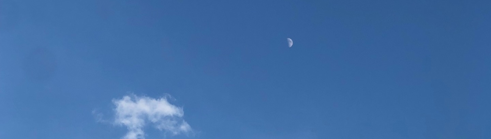

# LearnWave
## Graduate Student | Software Engineer

<!--

  
  

    LearnWave
  

 -->

### About Me
Develop to solve 👋

- **Graduate**: Electrical and Computer Engineering at Seoul National University

### What I'm Currently Working On
- Software Engineering
- Machine Learning
- Frontend Developing

### Check out my GitHub repository:

  

    
  

### Stats :

<!--   

    <b><em>Now listening to:</em></b>  
    
  
 -->
  
  

  <b><em>GitHub Stats:</em></b>  
       
  <b><em>Programming activity (Last 7 days):</em></b>  
    
  

### Programming Activity (Last 7 Days):
- Vite Web Programming
- Text Emotion Learning

 

<!--
### Hi there 👋
**acensia/acensia** is a ✨ _special_ ✨ repository because its `README.md` (this file) appears on your GitHub profile.

Here are some ideas to get you started:

- 🔭 I’m currently working on ...
- 🌱 I’m currently learning ...
- 👯 I’m looking to collaborate on ...
- 🤔 I’m looking for help with ...
- 💬 Ask me about ...
- 📫 How to reach me: ...
- 😄 Pronouns: ...
- ⚡ Fun fact: ...
-->
